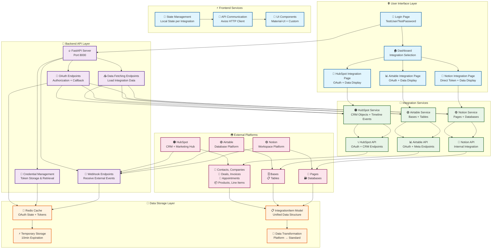

# Integration Platform Architecture

## Overview

This document provides a comprehensive explanation of the integration platform architecture, which enables seamless connectivity with HubSpot, Airtable, and Notion through a unified interface.

## System Architecture - Block Diagram



## Detailed Component Flowchart

```mermaid
flowchart TD
    subgraph "🔐 Authentication Flow"
        A1[User Login] --> A2[Validate Credentials]
        A2 --> A3[Set Session State]
        A3 --> A4[Redirect to Dashboard]
    end
    
    subgraph "🔗 Integration Connection Flow"
        B1[Select Integration] --> B2[Click Connect Button]
        B2 --> B3[Generate OAuth URL]
        B3 --> B4[Open OAuth Popup]
        B4 --> B5[User Authorizes]
        B5 --> B6[OAuth Callback]
        B6 --> B7[Exchange Code for Tokens]
        B7 --> B8[Store in Redis]
        B8 --> B9[Update UI State]
    end
    
    subgraph "📥 Data Loading Flow"
        C1[Click Load Data] --> C2[Retrieve Tokens from Redis]
        C2 --> C3[Make API Call to External Platform]
        C3 --> C4[Receive Raw Data]
        C4 --> C5[Transform to IntegrationItem]
        C5 --> C6[Convert to Dictionary]
        C6 --> C7[Send to Frontend]
        C7 --> C8[Display in UI]
    end
    
    subgraph "🔔 Webhook Processing Flow"
        D1[External Event Occurs] --> D2[Webhook Sent to Backend]
        D2 --> D3[Validate Webhook Payload]
        D3 --> D4[Store Event in Redis]
        D4 --> D5[Update UI if Connected]
    end
    
    A4 --> B1
    B9 --> C1
    C8 --> D1
```



## Feature Matrix

### 🔐 Authentication & Security Features
| Feature | Implementation | Security Level |
|---------|---------------|----------------|
| **User Login** | TestUser/TestPassword | Basic (Assessment) |
| **OAuth 2.0** | PKCE + State Validation | Enterprise |
| **Token Storage** | Redis with Expiration | High |
| **CSRF Protection** | State Parameter Validation | High |
| **Session Management** | Local State + Props | Medium |

### 🔌 Integration Features
| Platform | Authentication | Data Types | Special Features |
|----------|---------------|------------|------------------|
| **HubSpot** | OAuth 2.0 + PKCE | Contacts, Companies, Deals, Invoices, Appointments, Products, Line Items | Webhook Support, Timeline Events |
| **Airtable** | OAuth 2.0 + PKCE | Bases, Tables | Meta API Access |
| **Notion** | Internal Integration Token | Pages, Databases | Direct API Access |

### 📊 Data Management Features
| Feature | Description | Implementation |
|---------|-------------|----------------|
| **Unified Data Model** | IntegrationItem class | Standardized across all platforms |
| **Data Transformation** | Platform-specific converters | Maintains data integrity |
| **Real-time Updates** | Webhook event processing | Immediate data refresh |
| **Error Handling** | Layered error management | Graceful failure handling |

### 🚀 Performance Features
| Feature | Description | Benefit |
|---------|-------------|---------|
| **Async Operations** | Non-blocking I/O | High concurrency |
| **Connection Pooling** | Redis connection reuse | Reduced latency |
| **Stateless Design** | Horizontal scaling ready | Easy deployment |
| **Caching Strategy** | Redis for temporary data | Fast response times |

## Connection Architecture

### 🔗 Frontend ↔ Backend Connections
```
Frontend (Port 3000) ←→ Backend (Port 8000)
├── OAuth Authorization
├── Data Fetching
├── Credential Management
└── Webhook Event Display
```

### 🔗 Backend ↔ External APIs
```
Backend ←→ HubSpot API
├── OAuth Endpoints
├── CRM Object Endpoints
├── Timeline Event Endpoints
└── Webhook Receivers

Backend ←→ Airtable API
├── OAuth Endpoints
├── Meta API (Bases)
└── Meta API (Tables)

Backend ←→ Notion API
├── Internal Integration Token
├── Pages API
└── Databases API
```

### 🔗 Data Flow Connections
```
External Data → IntegrationItem Model → Frontend Display
├── HubSpot CRM Objects → Contact/Company/Deal Items → UI Cards
├── Airtable Bases/Tables → Base/Table Items → UI Lists
└── Notion Pages/Databases → Page/Database Items → UI Grids
```

## Technical Specifications

### 🖥️ Frontend Stack
- **Framework**: React 18
- **UI Library**: Material-UI (MUI)
- **HTTP Client**: Axios
- **Routing**: React Router DOM
- **State Management**: Local State + Props

### ⚡ Backend Stack
- **Framework**: FastAPI
- **Async Support**: httpx, asyncio
- **Data Validation**: Pydantic
- **Cache**: Redis (async)
- **Security**: OAuth 2.0 + PKCE

### 💾 Data Layer
- **Cache**: Redis (Docker)
- **Data Model**: IntegrationItem class
- **Serialization**: JSON
- **Storage**: In-memory + File-based

### 🔒 Security Features
- **OAuth 2.0**: Industry standard
- **PKCE**: Additional security layer
- **State Validation**: CSRF protection
- **Token Expiration**: Automatic cleanup
- **Secure Storage**: Redis with TTL

## Scalability Architecture

### 📈 Horizontal Scaling
```
Load Balancer → Multiple FastAPI Instances → Redis Cluster
├── Stateless Backend Design
├── Redis Connection Pooling
├── Async Request Handling
└── Health Check Endpoints
```

### 🚀 Performance Optimization
```
Request → Cache Check → API Call → Data Transform → Response
├── Redis for OAuth State
├── Async External API Calls
├── Efficient Data Transformation
└── Minimal Memory Footprint
```

## Monitoring & Health Checks

### 📊 System Health
- **Backend Status**: `/health` endpoint
- **Redis Connection**: Connection pool status
- **Integration Status**: Platform connectivity
- **Error Logging**: Structured error tracking

### 🔍 Debugging Features
- **Console Logging**: Detailed operation logs
- **Error Messages**: User-friendly error display
- **API Response Logging**: Request/response tracking
- **Webhook Event Logging**: Event processing status

## Deployment Architecture

### 🏗️ Development Environment
```
localhost:3000 (Frontend) ←→ localhost:8000 (Backend) ←→ Docker Redis
```

### 🚀 Production Environment
```
CDN → Load Balancer → Multiple Backend Instances → Redis Cluster + Database
```

## Conclusion

This integration platform demonstrates a **production-ready architecture** with:

✅ **Clear Component Separation** - Each layer has distinct responsibilities  
✅ **Secure Authentication** - OAuth 2.0 + PKCE implementation  
✅ **Scalable Design** - Stateless backend, async operations  
✅ **Unified Data Model** - Consistent data structure across platforms  
✅ **Real-time Updates** - Webhook support for live data  
✅ **Error Handling** - Graceful failure management  
✅ **Monitoring** - Health checks and logging  

The architecture is designed for **easy extension** to new platforms while maintaining **high security standards** and **performance optimization**.
